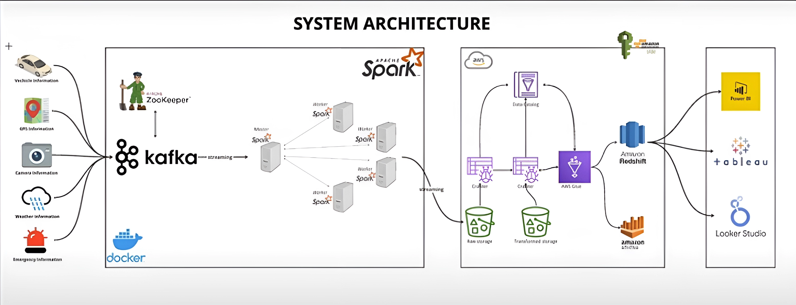

```markdown
# Vehicle Simulation System for smart cities

This is a Python script for simulating vehicle data and sending it to Kafka topics. It generates mock data for vehicle movement, GPS coordinates, weather conditions, and traffic camera snapshots.

## Requirements

- Python 3.x
- Confluent Kafka Python client (`confluent_kafka`)
- `simplejson` library

## Setup

1. Clone this repository to your local machine.

```
git clone https://github.com/your-username/vehicle-simulation.git
```

2. Install the required Python packages using pip.

```
pip install -r requirements.txt
```

3. Ensure you have Kafka set up and running. You can modify the Kafka server configuration in the script or set it via environment variables.

4. Modify the script's environment variables (optional) to customize Kafka topics and server settings.

```bash
export KAFKA_BOOTSTRAP_SERVER="your_kafka_server:9092"
export VEHICLE_TOPIC="vehicle_data"
export GPS_TOPIC="gps_data"
export TRAFFIC_TOPIC="traffic_data"
export WEATHER_TOPIC="weather_data"
export EMERGENCY_TOPIC="emergency_data"
```

## Usage

Run the script using Python.

## System architecture of the project


```bash
python main.py
```

## Functionality

- **Vehicle Data Generation**: Simulates movement of vehicles and generates data such as vehicle ID, timestamp, location, speed, and vehicle make/model.
- **GPS Data Generation**: Creates GPS data including speed and direction.
- **Traffic Camera Data Generation**: Generates snapshots from traffic cameras located along the simulated route.
- **Weather Data Generation**: Simulates weather conditions including temperature, weather condition, precipitation, wind speed, humidity, and air quality index (AQI).

## Contributing

Contributions are welcome! If you find any issues or want to add new features, feel free to open a pull request.

## License

This project is licensed under the MIT License - see the [LICENSE](LICENSE) file for details.
